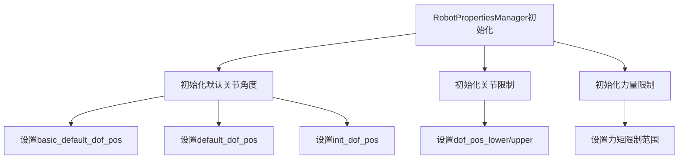
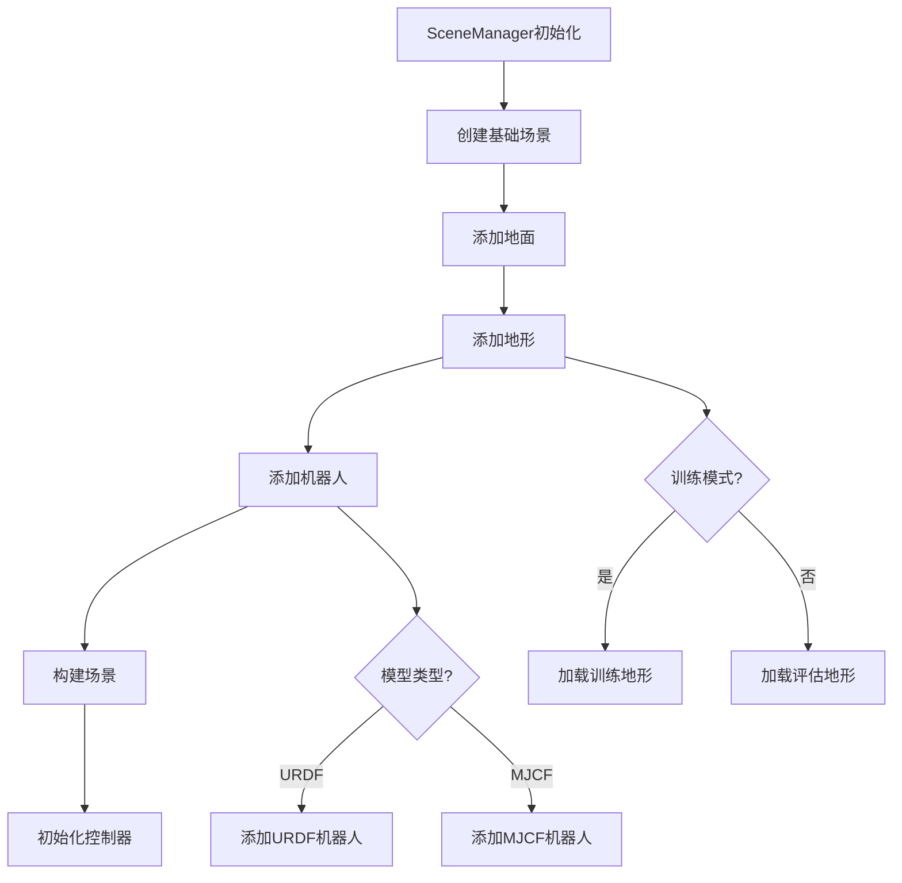
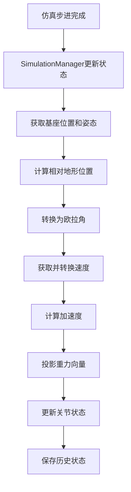
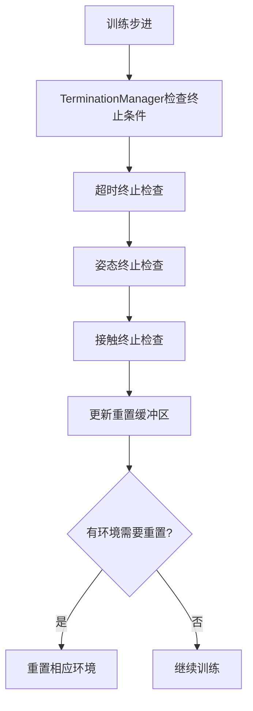

# env_supports.md

## 1. env_utils.py

这个文件非常杂，是一个技术债，有时间我整理一下。它包含了几个实用工具函数，主要用于环境中的随机数生成、课程学习调整和地形位置计算。

### 1.1. gs_rand_float 函数

```python
def gs_rand_float(lower: float, upper: float, shape, device: torch.device) -> torch.Tensor:
    """生成给定范围内的随机浮点数。"""
    return (upper - lower) * torch.rand(size=shape, device=device) + lower
```

### 1.2. adjust_scale 函数

```python
def adjust_scale(error: torch.Tensor,
                 lower_err: float, upper_err: float,
                 scale: torch.Tensor, scale_step: float,
                 min_range: float, range_cfg) -> tuple[torch.Tensor, torch.Tensor]:
    """
    根据误差调整课程学习的比例 scale，并返回更新后的范围。
    """
    min_condition = error < lower_err
    max_condition = error > upper_err
    # 增减比例
    scale[min_condition] += scale_step
    scale[max_condition] -= scale_step
    scale.clamp_(min_range, 1)
    range_min, range_max = range_cfg
    return scale * range_min, scale * range_max
```

### 1.3. get_relative_terrain_pos 函数

```python
def get_relative_terrain_pos(base_pos: torch.Tensor,
                             terrain_height: torch.Tensor,
                             horizontal_scale: float) -> torch.Tensor:
    """
    对一批 (x,y) 坐标执行双线性插值，返回调整后的基座位置。注意只改变 z 轴。
    """
    x, y = base_pos[:, 0], base_pos[:, 1]
    fx, fy = x / horizontal_scale, y / horizontal_scale
    x0 = torch.floor(fx).int()
    x1 = torch.min(x0 + 1, torch.full_like(x0, terrain_height.shape[1] - 1))
    y0 = torch.floor(fy).int()
    y1 = torch.min(y0 + 1, torch.full_like(y0, terrain_height.shape[0] - 1))
    # 防止越界
    x0 = torch.clamp(x0, 0, terrain_height.shape[1] - 1)
    x1 = torch.clamp(x1, 0, terrain_height.shape[1] - 1)
    y0 = torch.clamp(y0, 0, terrain_height.shape[0] - 1)
    y1 = torch.clamp(y1, 0, terrain_height.shape[0] - 1)
    Q11 = terrain_height[y0, x0]
    Q21 = terrain_height[y0, x1]
    Q12 = terrain_height[y1, x0]
    Q22 = terrain_height[y1, x1]
    wx = fx - x0
    wy = fy - y0
    height = (1 - wx) * (1 - wy) * Q11 + wx * (1 - wy) * Q21 \
        + (1 - wx) * wy * Q12 + wx * wy * Q22
    base_pos[:, 2] = base_pos[:, 2] - height
    return base_pos
```

## 2. CommandManager

CommandManager 是一个**命令管理器类**，它的主要作用是管理机器人训练过程中需要跟踪的各种命令（目标值）。在强化学习中，我们需要给机器人设定目标，比如让它以特定速度前进，或者让腿保持特定姿态，这些目标就是"命令"。

### 2.1. CommandManager 的具体功能

#### 2.1.1. 初始化方法 `__init__`

```python
def __init__(self, env):
    self.env = env
```

这个方法在创建 CommandManager 对象时自动执行，它保存了对环境对象的引用，这样就能访问环境的各种属性和方法。

#### 2.1.2. 初始化命令范围 [init_command_ranges](file:///home/ember/GitHub/wheel_quadruped_genesis/locomotion/wheel_legged_env/command_manager.py#L7-L51)

```python
def init_command_ranges(self):
    """Initialize command ranges for curriculum learning."""
    # 创建一个三维数组来存储命令范围
    self.env.command_ranges = torch.zeros(
        (self.env.num_envs, self.env.num_commands, 2),
        device=self.env.device, dtype=torch.float32)
```

这行代码创建了一个三维数组：

- 第一维：环境数量（并行训练的机器人数量）
- 第二维：命令数量（有多少种不同的目标）
- 第三维：2（每个命令有最小值和最大值两个范围）

#### 2.1.3. 命令的具体含义

```python
# 线速度X范围（前进/后退速度）
self.env.command_ranges[:, 0, 0] = 最小值
self.env.command_ranges[:, 0, 1] = 最大值

# 线速度Y范围（左右移动速度）
self.env.command_ranges[:, 1, 0] = 最小值
self.env.command_ranges[:, 1, 1] = 最大值

# 角速度范围（旋转速度）
self.env.command_ranges[:, 2, 0] = 最小值
self.env.command_ranges[:, 2, 1] = 最大值

# 腿部长度范围（各条腿的目标姿态）
self.env.command_ranges[:, 3, 0] = 最小值  # FL thigh
self.env.command_ranges[:, 3, 1] = 最大值  # FL thigh
# ... 其他腿部关节
```

在Python和NumPy/PyTorch中，冒号（:）在数组索引中表示"所有元素"或"完整维度"。

让我详细解释一下 `self.env.command_ranges[:, 0, 0]` 中各个维度和冒号的含义：

##### 三维数组结构

`command_ranges` 是一个三维数组，形状为 `(num_envs, num_commands, 2)`：

```text
维度0: 环境数量 (num_envs) - 并行训练的机器人环境数量
维度1: 命令索引 (num_commands) - 不同类型的命令
维度2: 范围边界 (2) - 每个命令的最小值和最大值
```

##### 冒号的具体含义

```python
self.env.command_ranges[:, 0, 0]
#                       ↑  ↑  ↑
#                       |  |  |
#                       |  |  └── 第三个维度索引: 0 (表示最小值)
#                       |  └───── 第二个维度索引: 0 (表示第一个命令)
#                       └──────── 第一个维度索引: : (表示所有环境)
```

- `:` (冒号) = "所有元素"
- `0` (数字) = "第一个元素"（索引从0开始）

##### 具体例子

假设我们有3个并行环境，2种命令，每种命令有最小值和最大值：

```python
# command_ranges 的形状是 (3, 2, 2)
# 可以想象成这样的结构：

# 环境0: [[命令0_min, 命令0_max], 
#        [命令1_min, 命令1_max]]

# 环境1: [[命令0_min, 命令0_max], 
#        [命令1_min, 命令1_max]]

# 环境2: [[命令0_min, 命令0_max], 
#        [命令1_min, 命令1_max]]

# 各种索引操作的含义：
command_ranges[:, 0, 0]    # = 所有环境的命令0的最小值
command_ranges[0, :, 0]    # = 环境0的所有命令的最小值
command_ranges[0, 0, :]    # = 环境0的命令0的最小值和最大值
command_ranges[1, 0, 1]    # = 环境1的命令0的最大值
```

##### 在实际代码中的应用

```python
# 设置所有环境中第一个命令（前进速度）的最小值
self.env.command_ranges[:, 0, 0] = self.env.command_cfg["lin_vel_x_range"][0] * \
    self.env.command_cfg["base_range"]

# 这行代码会同时设置:
# 环境0的前进速度最小值
# 环境1的前进速度最小值
# 环境2的前进速度最小值
# ...
# 环境N的前进速度最小值
```

##### 为什么这样设计？

使用冒号可以让我们一次性为所有并行环境设置相同的命令范围，而不需要写循环。这提高了代码效率和可读性：

```python
# 不使用冒号（低效方式）：
for i in range(num_envs):
    self.env.command_ranges[i, 0, 0] = min_value

# 使用冒号（高效方式）：
self.env.command_ranges[:, 0, 0] = min_value
```

这种方式在处理大量并行环境时特别有用，因为我们通常希望所有环境遵循相同的命令范围规则。

#### 2.1.4. 重新采样命令 [resample_commands](file:///home/ember/GitHub/wheel_quadruped_genesis/locomotion/wheel_legged_env/command_manager.py#L53-L60)

```python
def resample_commands(self, envs_idx):
    """Resample command values for specified environments."""
    for idx in envs_idx:  # 对于每个指定的环境
        for command_idx in range(self.env.num_commands):  # 对于每个命令
            # 获取该命令的范围
            low = self.env.command_ranges[idx, command_idx, 0]   # 最小值
            high = self.env.command_ranges[idx, command_idx, 1]  # 最大值
            # 在范围内随机生成一个命令值
            self.env.commands[idx, command_idx] = gs_rand_float(
                low, high, (1,), self.env.device)
```

这个方法会为指定的环境随机生成新的命令值，这些命令值在预设的范围内。

举个例子：

- 如果前进速度范围是 [-1.2, 1.2] 米/秒
- 这个方法可能会生成 0.5 米/秒 作为当前的目标速度

#### 2.1.5. 设置特定命令 [set_commands](file:///home/ember/GitHub/wheel_quadruped_genesis/locomotion/wheel_legged_env/command_manager.py#L62-L65)

```python
def set_commands(self, envs_idx, commands):
    """Set specific command values for specified environments."""
    self.env.commands[envs_idx] = torch.tensor(
        commands, device=self.env.device, dtype=torch.float32)
```

这个方法允许我们手动设置特定的命令值，而不是随机生成。

### 2.2. 整体工作流程

1. **初始化阶段**：
   - 创建 CommandManager 对象
   - 调用 [init_command_ranges()](file:///home/ember/GitHub/wheel_quadruped_genesis/locomotion/wheel_legged_env/command_manager.py#L7-L51) 设置每种命令的取值范围

2. **训练过程中**：
   - 定期调用 [resample_commands()](file:///home/ember/GitHub/wheel_quadruped_genesis/locomotion/wheel_legged_env/command_manager.py#L53-L60) 为机器人生成新的目标
   - 机器人尝试达到这些目标
   - 根据完成情况给予奖励

3. **手动控制时**：
   - 调用 [set_commands()](file:///home/ember/GitHub/wheel_quadruped_genesis/locomotion/wheel_legged_env/command_manager.py#L62-L65) 直接设置目标值

## 3. CurriculumLearning

CurriculumLearning（课程学习）是一种机器学习训练策略，灵感来源于人类学习过程。就像我们学习数学时先学加法再学乘法一样，课程学习让模型从简单任务开始，逐步过渡到复杂任务，以提高学习效率和最终性能。

### 3.1. CurriculumLearning 的具体功能

#### 3.1.1. 初始化方法 [**init**](file:///home/ember/GitHub/wheel_quadruped_genesis/locomotion/wheel_legged_env/curriculum_learning.py#L4-L5)

```python
def __init__(self, env):
    self.env = env
```

这个方法在创建 CurriculumLearning 对象时自动执行，保存了对环境对象的引用。

#### 3.1.2. 更新命令范围 [update_commands](file:///home/ember/GitHub/wheel_quadruped_genesis/locomotion/wheel_legged_env/curriculum_learning.py#L6-L32)

这是课程学习的核心方法，根据机器人当前的表现动态调整训练难度。

```python
def update_commands(self):
    """更新课程学习命令范围"""
    # 更新误差统计
    self.env.lin_vel_error /= self.env.num_envs
    self.env.ang_vel_error /= self.env.num_envs
    
    # 根据线速度误差调整命令范围
    lin_min_range, lin_max_range = adjust_scale(
        self.env.lin_vel_error,                    # 当前误差
        self.env.curriculum_cfg["lin_vel_err_range"][0],  # 最小误差阈值
        self.env.curriculum_cfg["lin_vel_err_range"][1],  # 最大误差阈值
        self.env.curriculum_lin_vel_scale,         # 当前缩放比例
        self.env.curriculum_cfg["curriculum_lin_vel_step"],  # 调整步长
        self.env.curriculum_cfg["curriculum_lin_vel_min_range"], # 最小范围
        self.env.command_cfg["lin_vel_x_range"]    # 基础范围
    )
    # 更新实际命令范围
    self.env.command_ranges[:, 0, 0] = lin_min_range.squeeze()
    self.env.command_ranges[:, 0, 1] = lin_max_range.squeeze()
```

#### 3.1.3. 更新终止条件 [update_termination_conditions](file:///home/ember/GitHub/wheel_quadruped_genesis/locomotion/wheel_legged_env/curriculum_learning.py#L34-L54)

根据学习进度调整训练的严格程度：

```python
def update_termination_conditions(self):
    # 根据平均存活时间调整终止条件的严格程度
    mean_survival_time = self.env.episode_lengths.mean()
    target_survival_time = self.env.env_cfg["episode_length_s"] / self.env.dt * 0.5
    
    # 如果平均存活时间太短，放宽终止条件
    if mean_survival_time < target_survival_time * 0.5:
        # 逐步放宽角度限制
        current_roll_limit = self.env.env_cfg["termination_if_roll_greater_than"]
        current_pitch_limit = self.env.env_cfg["termination_if_pitch_greater_than"]
        
        # 增加5度的宽容度
        new_roll_limit = min(current_roll_limit + 1.0, 90.0)
        new_pitch_limit = min(current_pitch_limit + 1.0, 60.0)
        
        self.env.env_cfg["termination_if_roll_greater_than"] = new_roll_limit
        self.env.env_cfg["termination_if_pitch_greater_than"] = new_pitch_limit
```

#### 3.1.4. 更新控制参数 [update_control_parameters](file:///home/ember/GitHub/wheel_quadruped_genesis/locomotion/wheel_legged_env/curriculum_learning.py#L56-L85)

根据学习进度调整控制器参数：

```python
def update_control_parameters(self):
    # 根据平均存活时间调整PD控制器参数
    mean_survival_time = self.env.episode_lengths.mean()
    target_survival_time = self.env.env_cfg["episode_length_s"] / self.env.dt * 0.5
    
    # 如果存活时间足够长，可以增加控制器的激进程度
    if mean_survival_time > target_survival_time * 1.5:
        # 增加PD增益以获得更精确的控制
        current_kp = self.env.env_cfg["joint_kp"]
        current_kv = self.env.env_cfg["joint_kv"]
        
        # 适度增加控制增益
        new_kp = min(current_kp * 1.05, 80.0)
        new_kv = min(current_kv * 1.05, 2.0)
        
        self.env.env_cfg["joint_kp"] = new_kp
        self.env.env_cfg["joint_kv"] = new_kv
        
        # 更新实际的控制器参数
        self.env.robot.set_dofs_kp(
            [new_kp] * self.env.num_actions, 
            self.env.motors_dof_idx
        )
        self.env.robot.set_dofs_kv(
            [new_kv] * self.env.num_actions, 
            self.env.motors_dof_idx
        )
```

### 3.2. 工作原理详解

#### 3.2.1. 课程学习的核心思想

1. **从简单开始**：开始时给机器人设置较简单的任务（如较小的速度范围）
2. **动态调整**：根据机器人表现自动调整任务难度
3. **逐步提升**：随着机器人能力提升，逐渐增加任务难度

#### 3.2.2. 调整机制

```python
# 核心调整逻辑在 adjust_scale 函数中
def adjust_scale(error, lower_err, upper_err, scale, scale_step, min_range, range_cfg):
    min_condition = error < lower_err    # 误差太小（任务太简单）
    max_condition = error > upper_err    # 误差太大（任务太难）
    
    # 任务太简单，增加难度
    scale[min_condition] += scale_step
    
    # 任务太难，降低难度
    scale[max_condition] -= scale_step
    
    scale.clamp_(min_range, 1)  # 限制比例范围
    range_min, range_max = range_cfg
    return scale * range_min, scale * range_max  # 返回新范围
```

### 3.3. 实际应用价值

1. **提高学习效率**：避免一开始给机器人过难的任务导致学习困难
2. **增强稳定性**：逐步增加难度有助于训练稳定策略
3. **适应性强**：根据实际表现自动调整，无需手动干预

通过这种方式，机器人可以像人类学习一样，从简单任务开始，逐步掌握更复杂的技能。

好的，我来详细解释一下 DomainRandomization 类的作用和逻辑。

## 4. DomainRandomization

DomainRandomization（域随机化）是一种强化学习训练技术，通过在训练过程中随机改变环境的各种物理参数，让机器人学会适应不同的环境条件，从而提高策略的泛化能力。这就像让学生在不同的教室、用不同的笔、在不同的时间考试，以检验他们是否真正掌握了知识。

### 4.1. DomainRandomization 的具体功能

#### 4.1.1. 初始化方法 [**init**](file:///home/ember/GitHub/wheel_quadruped_genesis/locomotion/wheel_legged_env/domain_randomization.py#L5-L6)

```python
def __init__(self, env):
    self.env = env
```

这个方法在创建 DomainRandomization 对象时自动执行，保存了对环境对象的引用。

#### 4.1.2. 应用随机化 [apply_randomization](file:///home/ember/GitHub/wheel_quadruped_genesis/locomotion/wheel_legged_env/domain_randomization.py#L8-L100)

这是域随机化的核心方法，为指定的环境应用各种随机化参数。

```python
def apply_randomization(self, envs_idx):
    """应用域随机化"""
    if len(envs_idx) == 0:
        return
```

如果没有任何环境需要随机化，就直接返回。

#### 4.1.3. 摩擦系数随机化

```python
# Friction randomization
friction_ratio = (self.env.friction_ratio_low + self.env.friction_ratio_range * 
                 torch.rand(len(envs_idx), self.env.robot.n_links, device=self.env.device))
self.env.robot.set_friction_ratio(
    friction_ratio=friction_ratio,
    links_idx_local=np.arange(0, self.env.robot.n_links),
    envs_idx=envs_idx
)
```

这会为每个环境中的每个链接（机器人的每个部分）设置不同的摩擦系数，模拟在不同材质表面上行走的情况。

#### 4.1.4. 质量随机化

```python
# Mass randomization
base_mass_shift = (self.env.base_mass_low + self.env.base_mass_range * 
                  torch.rand(len(envs_idx), 1, device=self.env.device))
other_mass_shift = (-self.env.other_mass_low + self.env.other_mass_range * 
                   torch.rand(len(envs_idx), self.env.robot.n_links - 1, 
                             device=self.env.device))
mass_shift = torch.cat((base_mass_shift, other_mass_shift), dim=1)
self.env.robot.set_mass_shift(
    mass_shift=mass_shift,
    links_idx_local=np.arange(0, self.env.robot.n_links),
    envs_idx=envs_idx
)
```

这会随机改变机器人各部分的质量，模拟携带不同重量物品的情况。

#### 4.1.5. 重心随机化

```python
# Center of mass randomization
base_com_shift = (-self.env.domain_rand_cfg["random_base_com_shift"] / 2 + 
    self.env.domain_rand_cfg["random_base_com_shift"] * 
    torch.rand(len(envs_idx), 1, 3, device=self.env.device))
other_com_shift = (-self.env.domain_rand_cfg["random_other_com_shift"] / 2 + 
    self.env.domain_rand_cfg["random_other_com_shift"] * 
    torch.rand(len(envs_idx), self.env.robot.n_links - 1, 3, device=self.env.device))
com_shift = torch.cat((base_com_shift, other_com_shift), dim=1)
self.env.robot.set_COM_shift(
    com_shift=com_shift,
    links_idx_local=np.arange(0, self.env.robot.n_links),
    envs_idx=envs_idx
)
```

这会随机改变机器人各部分的重心位置，模拟装载不均匀的情况。

#### 4.1.6. PD控制器增益随机化

```python
# PD gain randomization
kp_shift = ((self.env.kp_low + self.env.kp_range *
            torch.rand(len(envs_idx), self.env.num_actions, device=self.env.device)) * 
           torch.from_numpy(self.env.kp[0]).to(self.env.device))
self.env.robot.set_dofs_kp(
    kp_shift.cpu().numpy(), self.env.motors_dof_idx, envs_idx=envs_idx)

kv_shift = ((self.env.kv_low + self.env.kv_range *
            torch.rand(len(envs_idx), self.env.num_actions, device=self.env.device)) * 
           torch.from_numpy(self.env.kv[0]).to(self.env.device))
self.env.robot.set_dofs_kv(
    kv_shift.cpu().numpy(), self.env.motors_dof_idx, envs_idx=envs_idx)
```

这会随机改变控制器的比例和微分增益，模拟不同控制性能的情况。

#### 4.1.7. 关节角度随机化

```python
# Joint angle randomization
dof_pos_shift = (self.env.joint_angle_low + self.env.joint_angle_range * 
    torch.rand(len(envs_idx), self.env.num_actions,
               device=self.env.device, dtype=torch.float))
self.env.default_dof_pos[envs_idx] = dof_pos_shift + self.env.basic_default_dof_pos
```

这会为每个环境设置不同的初始关节角度，增加训练的多样性。

#### 4.1.8. 阻尼参数随机化

```python
# Damping randomization with curriculum
if self.env.is_damping_descent:
    mean_episode_length = self.env.episode_lengths[envs_idx].mean() / \
        (self.env.env_cfg["episode_length_s"] / self.env.dt)

    if mean_episode_length > self.env.damping_threshold:
        self.env.damping_base -= self.env.damping_step
        if self.env.damping_base < self.env.damping_min:
            self.env.damping_base = self.env.damping_min
    else:
        self.env.damping_base += self.env.damping_step
        if self.env.damping_base > self.env.damping_max:
            self.env.damping_base = self.env.damping_max

damping = ((self.env.dof_damping_low + self.env.dof_damping_range *
           torch.rand(len(envs_idx), self.env.robot.n_dofs, device=self.env.device)) * 
          self.env.damping_base)
damping[:, :6] = 0
self.env.robot.set_dofs_damping(
    damping=damping.cpu().numpy(),
    dofs_idx_local=np.arange(0, self.env.robot.n_dofs),
    envs_idx=envs_idx)
```

这会随机改变关节阻尼参数，并结合课程学习动态调整。

#### 4.1.9. 惯性参数随机化

```python
# Armature randomization
armature = (self.env.dof_armature_low + self.env.dof_armature_range *
            torch.rand(len(envs_idx), self.env.robot.n_dofs, device=self.env.device))
armature[:, :6] = 0
self.env.robot.set_dofs_armature(
    armature=armature.cpu().numpy(),
    dofs_idx_local=np.arange(0, self.env.robot.n_dofs),
    envs_idx=envs_idx)
```

这会随机改变关节的惯性参数，模拟不同的机械特性。

### 4.2. 工作原理详解

#### 4.2.1. 域随机化的核心思想

1. **多样性训练**：在训练过程中不断改变物理环境参数
2. **泛化能力**：让策略适应各种不同的环境条件
3. **鲁棒性**：提高策略在真实世界中的稳定性

#### 4.2.2. 随机化机制

```python
# 核心随机化逻辑
torch.rand(len(envs_idx), self.env.robot.n_links, device=self.env.device)
# 生成 [0,1) 范围内的随机数
# 通过线性变换映射到目标范围
friction_ratio = (self.env.friction_ratio_low + self.env.friction_ratio_range * random_numbers)
```

### 4.3. 实际应用价值

1. **提高泛化能力**：策略能适应未见过的环境
2. **增强鲁棒性**：在真实世界中表现更稳定
3. **减少真实世界训练**：大部分训练可以在仿真中完成
4. **模拟传感器噪声**：通过参数变化模拟真实传感器的不确定性

通过域随机化，我们可以训练出一个更加鲁棒和通用的控制策略，使其在面对真实世界的各种变化时仍能保持良好的性能。

好的，我来详细解释一下 ObservationManager 类的作用和逻辑。

## 5. ObservationManager

ObservationManager（观测管理器）负责处理强化学习中的观测值（Observations）生成和管理。在强化学习中，观测值是智能体（机器人）从环境中获取的信息，用于做出决策。ObservationManager 就像机器人的"感知系统"，负责收集和整理各种传感器数据。

### 5.1. ObservationManager 的具体功能

#### 5.1.1. 初始化方法 [**init**](file:///home/ember/GitHub/wheel_quadruped_genesis/locomotion/wheel_legged_env/observation_manager.py#L6-L7)

```python
def __init__(self, env):
    self.env = env
```

保存对环境对象的引用，以便访问环境的各种状态信息。

#### 5.1.2. 计算当前观测值 [compute_observations](file:///home/ember/GitHub/wheel_quadruped_genesis/locomotion/wheel_legged_env/observation_manager.py#L9-L31)

这是核心方法，负责收集和整理当前时刻的观测信息。

```python
def compute_observations(self):
    """计算当前观测值"""
    # Base angular velocity
    ang_vel = self.env.base_ang_vel * self.env.obs_scales["ang_vel"]
    
    # Projected gravity
    gravity = self.env.projected_gravity
    
    # Relative joint positions
    rel_dof_pos = (self.env.dof_pos[:, self.env.joint_dof_idx_np] - 
                  self.env.default_dof_pos[:, self.env.joint_dof_idx_np]) * \
                 self.env.obs_scales["dof_pos"]
    
    # Joint velocities
    dof_vel = self.env.dof_vel * self.env.obs_scales["dof_vel"]
    
    # Current actions
    actions = self.env.actions
    
    slice_obs = torch.cat([
        ang_vel, gravity, rel_dof_pos, dof_vel, actions
    ], axis=-1)
    
    return slice_obs
```

具体维度分解如下：

```text
ang_vel (角速度): 3维
base_ang_vel[:, 0] - 绕X轴旋转角速度
base_ang_vel[:, 1] - 绕Y轴旋转角速度
base_ang_vel[:, 2] - 绕Z轴旋转角速度
gravity (重力投影): 3维
projected_gravity[:, 0] - X轴重力分量
projected_gravity[:, 1] - Y轴重力分量
projected_gravity[:, 2] - Z轴重力分量
rel_dof_pos (相对关节位置): 12维
机器人有16个自由度(4条腿*4个关节)
其中12个是普通关节(hip, thigh, calf)，4个是轮子关节(foot)
rel_dof_pos只包含12个普通关节相对于默认位置的偏差
self.env.joint_dof_idx_np索引标识了这12个关节
dof_vel (关节速度): 16维
所有16个关节的速度值
包括4个普通关节和4个轮子关节
actions (当前动作): 16维
当前应用到所有16个关节的动作值
总计：3 + 3 + 12 + 16 + 16 = 50维
```

#### 5.1.3. 更新历史观测值 [update_history](file:///home/ember/GitHub/wheel_quadruped_genesis/locomotion/wheel_legged_env/observation_manager.py#L33-L43)

管理观测值的历史记录，这对于需要考虑时间序列信息的控制任务非常重要。

```python
def update_history(self, slice_obs):
    """更新历史观测值"""
    if self.env.history_length > 1:
        self.env.history_obs_buf[:, :-1, :] = self.env.history_obs_buf[:, 1:, :].clone()
    self.env.history_obs_buf[:, -1, :] = slice_obs
    
    obs_buf = torch.cat([self.env.history_obs_buf, slice_obs.unsqueeze(1)],
                       dim=1).view(self.env.num_envs, -1)
    obs_buf = torch.cat([obs_buf, self.env.commands * self.env.commands_scale], axis=-1)
    
    return obs_buf
```

## 6. RewardFunctions

在强化学习中，奖励函数就像是给机器人的"评分系统"。就像训练宠物时给它零食奖励一样，奖励函数告诉机器人什么样的行为是好的，什么样的行为是不好的。

### 6.1. RewardFunctions 类的结构

#### 6.1.1. 初始化方法

```python
def __init__(self, env):
    self.env = env
```

保存对环境的引用，这样奖励函数就能访问机器人的状态信息。

#### 6.1.2. 奖励函数命名规则

所有奖励函数都以 `_reward_` 开头：

- [_reward_tracking_lin_x_vel](file:///home/ember/GitHub/wheel_quadruped_genesis/locomotion/wheel_legged_env/reward_functions.py#L39-L49) - 前进速度跟踪奖励
- [_reward_projected_gravity](file:///home/ember/GitHub/wheel_quadruped_genesis/locomotion/wheel_legged_env/reward_functions.py#L125-L133) - 姿态控制奖励
- [_reward_joint_action_rate](file:///home/ember/GitHub/wheel_quadruped_genesis/locomotion/wheel_legged_env/reward_functions.py#L169-L177) - 动作平滑性奖励

### 6.2. 各类奖励函数详解

#### 6.2.1. 速度跟踪奖励 (Velocity Tracking Rewards)

##### 前进速度奖励

```python
def _reward_tracking_lin_x_vel(self):
    # 计算速度误差
    lin_vel_error = torch.square(
        self.env.commands[:, 0] - self.env.base_lin_vel[:, 0])
    
    # 指数奖励函数：误差越小奖励越高
    reward = torch.exp(-lin_vel_error / (sigma**2))
    return reward * self.env.gravity_factor
```

**解释**：

- `self.env.commands[:, 0]` - 目标前进速度
- `self.env.base_lin_vel[:, 0]` - 实际前进速度
- 误差越小，`torch.exp(-error)` 越接近 1（最大奖励）

#### 6.2.2. 姿态控制奖励 (Posture Control Rewards)

##### 重力方向奖励

```python
def _reward_projected_gravity(self):
    # 惩罚机器人倾斜
    reward = torch.sum(torch.square(
        self.env.projected_gravity[:, :2]), dim=1)
    return reward * self.env.gravity_factor
```

**解释**：

- 理想情况下重力向量应该是 [0, 0, -1]
- 如果机器人倾斜，前两个分量就不为0
- 惩罚这些非零分量，鼓励机器人保持水平

#### 6.2.3. 动作正则化奖励 (Action Regularization Rewards)

##### 动作变化惩罚

```python
def _reward_joint_action_rate(self):
    # 惩罚关节动作的快速变化
    return torch.sum(torch.square(
        self.env.last_actions[:, self.env.joint_dof_idx_np] -
        self.env.actions[:, self.env.joint_dof_idx_np]), dim=1)
```

**解释**：

- 鼓励动作平滑，避免突然的动作变化
- 就像开车时避免急刹车急加速一样

#### 6.2.4. 步态质量奖励 (Gait Quality Rewards)

##### 足部位置奖励

```python
def _reward_feet_distance_xy_exp(self):
    # 鼓励足部放在理想位置
    stance_diff_x = torch.square(desired_xs - actual_xs)
    stance_diff_y = torch.square(desired_ys - actual_ys)
    
    # 指数奖励：位置越准确奖励越高
    reward = torch.exp(-error / (std**2))
    return reward * self.env.gravity_factor
```

#### 6.2.5. 对称性奖励 (Symmetry Rewards)

##### 关节对称奖励

```python
def _reward_joint_mirror(self):
    reward = torch.zeros(self.env.num_envs, device=self.env.device)
    
    # 计算对称关节的差异
    for joint_pair_indices in self.env.joint_mirror_indices:
        left_idx, right_idx = joint_pair_indices
        diff = torch.square(
            self.env.dof_pos[:, left_idx] - self.env.dof_pos[:, right_idx])
        reward += diff
    
    # 差异越小奖励越高
    return reward * self.env.gravity_factor
```

#### 6.2.6. 约束奖励 (Constraint Rewards)

##### 碰撞惩罚

```python
def _reward_collision(self):
    collision = torch.zeros(self.env.num_envs, device=self.env.device)
    
    # 如果机器人身体碰到地面就惩罚
    for idx in self.env.reset_links:
        collision += torch.square(
            self.env.connect_force[:, idx, :]).sum(dim=1)
    
    return collision * self.env.gravity_factor
```

## 7. RobotController

RobotController（机器人控制器）是负责将强化学习算法输出的动作转换为实际机器人控制指令的模块。它就像机器人的"执行系统"，接收高层指令并将其转化为具体的关节控制命令。

### 7.1. RobotController 的具体功能

#### 7.1.1. 初始化方法 [**init**](file:///home/ember/GitHub/wheel_quadruped_genesis/locomotion/wheel_legged_env/robot_controller.py#L5-L6)

```python
def __init__(self, env):
    self.env = env
```

保存对环境对象的引用，以便访问机器人的控制接口和配置参数。

#### 7.1.2. 应用动作方法 [apply_actions](file:///home/ember/GitHub/wheel_quadruped_genesis/locomotion/wheel_legged_env/robot_controller.py#L8-L32)

这是控制器的核心方法，负责将强化学习输出的动作转换为实际的机器人控制命令。

```python
def apply_actions(self, actions):
    """应用动作到机器人"""
    # Clip actions
    self.env.actions = torch.clip(
        actions, -self.env.env_cfg["clip_actions"], self.env.env_cfg["clip_actions"]
    )
```

## 8. RobotPropertiesManager

RobotPropertiesManager（机器人属性管理器）负责初始化和管理机器人的各种物理属性和限制参数。它就像机器人的"配置中心"，负责设置关节角度、运动限制、力量限制等基本信息。

### 8.1. RobotPropertiesManager 的具体功能

#### 8.1.1. 初始化方法 [**init**](file:///home/ember/GitHub/wheel_quadruped_genesis/locomotion/wheel_legged_env/robot_properties_manager.py#L6-L7)

```python
def __init__(self, env):
    self.env = env
```

保存对环境对象的引用，以便访问机器人的配置和状态。

#### 8.1.2. 初始化机器人属性 [init_robot_properties](file:///home/ember/GitHub/wheel_quadruped_genesis/locomotion/wheel_legged_env/robot_properties_manager.py#L9-L35)

这个方法初始化机器人的基本关节角度配置。

```python
def init_robot_properties(self):
    """Initialize robot properties like default positions."""
    # Default joint angles
    self.env.basic_default_dof_pos = torch.tensor(
        [self.env.env_cfg["default_joint_angles"][name]
         for name in self.env.env_cfg["joint_names"]],
        device=self.env.device,
        dtype=gs.tc_float,
    )
```

#### 8.1.3. 初始化关节限制 [init_dof_limits](file:///home/ember/GitHub/wheel_quadruped_genesis/locomotion/wheel_legged_env/robot_properties_manager.py#L37-L53)

这个方法设置每个关节的运动范围限制。

```python
def init_dof_limits(self):
    """Initialize joint limits."""
    lower = []
    upper = []
    for name in self.env.env_cfg["joint_names"]:
        if name in self.env.env_cfg["dof_limit"]:
            lower.append(self.env.env_cfg["dof_limit"][name][0])
            upper.append(self.env.env_cfg["dof_limit"][name][1])
        else:
            # For joints without specified limits (e.g., continuous joints)
            lower.append(float('-inf'))
            upper.append(float('inf'))

    self.env.dof_pos_lower = torch.tensor(lower, device=self.env.device)
    self.env.dof_pos_upper = torch.tensor(upper, device=self.env.device)
```

#### 8.1.4. 初始化力量限制 [init_force_limits](file:///home/ember/GitHub/wheel_quadruped_genesis/locomotion/wheel_legged_env/robot_properties_manager.py#L55-L70)

这个方法设置每个关节的力量/力矩限制。

```python
def init_force_limits(self):
    """Initialize force/torque limits."""
    lower = np.array([[-self.env.env_cfg["safe_force"][name]
                     for name in self.env.env_cfg["joint_names"]]
                     for _ in range(self.env.num_envs)])
    upper = np.array([[self.env.env_cfg["safe_force"][name]
                      for name in self.env.env_cfg["joint_names"]]
                     for _ in range(self.env.num_envs)])

    self.env.robot.set_dofs_force_range(
        lower=torch.tensor(lower, device=self.env.device, dtype=torch.float32),
        upper=torch.tensor(upper, device=self.env.device, dtype=torch.float32),
        dofs_idx_local=self.env.motors_dof_idx,
    )
```

### 8.2. 工作流程



通过 RobotPropertiesManager，机器人获得了正确的初始配置和物理限制，为后续的控制和训练奠定了基础。

## 9. SceneManager

SceneManager（场景管理器）负责创建和管理整个仿真的场景环境。它就像一个"舞台导演"，负责搭建机器人训练的舞台，包括物理引擎设置、地形创建、机器人添加等。

### 9.1. SceneManager 的具体功能

#### 9.1.1. 初始化方法 [**init**](file:///home/ember/GitHub/wheel_quadruped_genesis/locomotion/wheel_legged_env/scene_manager.py#L6-L7)

```python
def __init__(self, env):
    self.env = env
```

保存对环境对象的引用。

#### 9.1.2. 创建场景 [create_scene](file:///home/ember/GitHub/wheel_quadruped_genesis/locomotion/wheel_legged_env/scene_manager.py#L9-L37)

这个方法创建仿真的基本场景框架。

```python
def create_scene(self, show_viewer, num_view):
    """Create the simulation scene."""
    self.env.scene = gs.Scene(
        sim_options=gs.options.SimOptions(dt=self.env.dt, substeps=5),
        viewer_options=gs.options.ViewerOptions(
            max_FPS=int(0.5 / self.env.dt),
            camera_pos=(2.0, 0.0, 2.5),
            camera_lookat=(0.0, 0.0, 0.5),
            camera_fov=40,
        ),
        vis_options=gs.options.VisOptions(
            rendered_envs_idx=list(range(num_view))),
        rigid_options=gs.options.RigidOptions(
            dt=self.env.dt,
            constraint_solver=gs.constraint_solver.Newton,
            enable_collision=True,
            enable_joint_limit=True,
            batch_dofs_info=True,
        ),
        show_viewer=show_viewer,
    )

    # Add ground plane
    self.env.scene.add_entity(gs.morphs.URDF(
        file="assets/terrain/plane/plane.urdf", fixed=True))
```

#### 9.1.3. 添加地形 [add_terrain](file:///home/ember/GitHub/wheel_quadruped_genesis/locomotion/wheel_legged_env/scene_manager.py#L39-L79)

这个方法根据配置添加不同类型的地形。

```python
def add_terrain(self):
    """Add terrain to the simulation."""
    # Initialize base position and orientation
    self.env.base_init_pos = torch.tensor(
        self.env.env_cfg["base_init_pos"]["urdf"], device=self.env.device)
    self.env.base_init_quat = torch.tensor(
        self.env.env_cfg["base_init_quat"], device=self.env.device)
    # ... 更多初始化
    
    if self.env.terrain_cfg["terrain"]:
        # 根据训练/评估模式添加不同地形
        if self.env.mode:
            # Training terrain
            height_field_path = "assets/terrain/png/" + \
                self.env.terrain_cfg["train"] + ".png"
            self.env.height_field = cv2.imread(
                height_field_path, cv2.IMREAD_GRAYSCALE)
            # 添加高度场地形
        else:
            # Evaluation terrain
            # 添加评估用的地形
```

#### 9.1.4. 添加机器人 [add_robot](file:///home/ember/GitHub/wheel_quadruped_genesis/locomotion/wheel_legged_env/scene_manager.py#L81-L115)

这个方法根据配置添加机器人模型。

```python
def add_robot(self, robot_morphs):
    """Add robot to the simulation."""
    # 根据地形和模式设置初始位置
    base_init_pos = self.env.base_init_pos.cpu().numpy()
    if self.env.terrain_cfg["terrain"] and self.env.mode:
        base_init_pos = self.env.base_terrain_pos[0].cpu().numpy()

    # 根据模型类型添加机器人
    if robot_morphs == "urdf":
        self.env.robot = self.env.scene.add_entity(
            gs.morphs.URDF(
                file=self.env.env_cfg["urdf"],
                pos=base_init_pos,
                quat=self.env.base_init_quat.cpu().numpy(),
                # ... 其他参数
            ))
    elif robot_morphs == "mjcf":
        # 添加MJCF格式的机器人
```

#### 9.1.5. 构建场景 [build_scene](file:///home/ember/GitHub/wheel_quadruped_genesis/locomotion/wheel_legged_env/scene_manager.py#L117-L143)

这个方法完成场景的最终构建。

```python
def build_scene(self):
    """Build the simulation scene with all entities."""
    self.env.scene.build(n_envs=self.env.num_envs)

    # 创建关节索引映射
    self.env.motors_dof_idx = [self.env.robot.get_joint(name).dof_start
                               for name in self.env.env_cfg["joint_names"]]

    # 区分关节和轮子
    joint_dof_idx = []
    wheel_dof_idx = []
    for i in range(len(self.env.env_cfg["joint_names"])):
        if self.env.env_cfg["joint_type"][self.env.env_cfg["joint_names"][i]] == "joint":
            joint_dof_idx.append(i)
            # ...
        elif self.env.env_cfg["joint_type"][self.env.env_cfg["joint_names"][i]] == "wheel":
            wheel_dof_idx.append(i)
            # ...

    # 初始化PD控制参数
    self._init_pd_control()
```

#### 9.1.6. 初始化PD控制 [_init_pd_control](file:///home/ember/GitHub/wheel_quadruped_genesis/locomotion/wheel_legged_env/scene_manager.py#L145-L188)

这个方法初始化机器人的PD控制器参数。

```python
def _init_pd_control(self):
    """Initialize PD control parameters."""
    # 比例增益
    self.env.kp = np.full((self.env.num_envs, self.env.num_actions),
                          self.env.env_cfg["joint_kp"])
    self.env.kp[:, self.env.wheel_dof_idx_np] = 0.0

    # 微分增益
    self.env.kv = np.full((self.env.num_envs, self.env.num_actions),
                          self.env.env_cfg["joint_kv"])
    self.env.kv[:, self.env.wheel_dof_idx_np] = self.env.env_cfg["wheel_kv"]

    # 设置PD参数
    self.env.robot.set_dofs_kp(self.env.kp, self.env.motors_dof_idx)
    self.env.robot.set_dofs_kv(self.env.kv, self.env.motors_dof_idx)
    
    # 设置阻尼和惯性参数
    # ...
```

### 9.2. 工作流程



通过 SceneManager，整个仿真环境被正确设置，为机器人训练提供了完整的物理环境和控制接口。
读取SimulationManager文件以了解其功能

```toolCall::read_file::call_51b3b03fb70d4ee69d05696d::INIT
```

## 10. SimulationManager

SimulationManager（仿真管理器）负责更新和管理机器人仿真过程中的各种状态信息。它就像机器人的"状态感知系统"，持续监控机器人的位置、姿态、速度、加速度等各种状态参数。

### 10.1. SimulationManager 的具体功能

#### 10.1.1. 初始化方法 [**init**](file:///home/ember/GitHub/wheel_quadruped_genesis/locomotion/wheel_legged_env/simulation_manager.py#L5-L6)

```python
def __init__(self, env):
    self.env = env
```

保存对环境对象的引用，以便访问机器人的状态信息。

#### 10.1.2. 更新仿真状态 [update_simulation_state](file:///home/ember/GitHub/wheel_quadruped_genesis/locomotion/wheel_legged_env/simulation_manager.py#L8-L49)

这是核心方法，负责更新机器人在仿真中的所有状态信息。

```python
def update_simulation_state(self):
    """更新仿真状态"""
    # 更新基座位置和姿态
    # 计算欧拉角
    # 更新基座速度和加速度
    # 更新关节状态
    # 更新历史状态
```

### 10.2. 几何变换详解

SimulationManager 大量使用了几何变换函数：

#### 10.2.1. 四元数反变换 `inv_quat`

```python
# 四元数 q = [w, x, y, z]
# 其逆为 q_inv = [w, -x, -y, -z]
inv_base_quat = inv_quat(self.env.base_quat)
```

#### 10.2.2. 向量四元数变换 `transform_by_quat`

```python
# 将向量从世界坐标系变换到机体坐标系
body_vel = transform_by_quat(world_vel, inv_base_quat)
```

#### 10.2.3. 四元数乘法 `transform_quat_by_quat`

```python
# 计算相对姿态
relative_quat = transform_quat_by_quat(initial_quat_inv, current_quat)
```

### 10.3. 工作流程



通过 SimulationManager，机器人在每个仿真步进后都能获得完整、准确的状态信息，为后续的控制、奖励计算和决策提供基础数据。

## 11. TerminationManager

TerminationManager（终止管理器）负责判断强化学习训练中的回合（episode）何时应该结束。它就像一个"裁判"，监控机器人的状态并在满足特定条件时终止当前训练回合并重置环境。

### 11.1. TerminationManager 的具体功能

#### 11.1.1. 初始化方法 [**init**](file:///home/ember/GitHub/wheel_quadruped_genesis/locomotion/wheel_legged_env/termination_manager.py#L4-L5)

```python
def __init__(self, env):
    self.env = env
```

保存对环境对象的引用，以便访问机器人的状态和配置。

#### 11.1.2. 检查终止条件 [check_termination](file:///home/ember/GitHub/wheel_quadruped_genesis/locomotion/wheel_legged_env/termination_manager.py#L7-L23)

这是核心方法，负责检查所有终止条件并更新重置缓冲区。

```python
def check_termination(self):
    """Check termination conditions."""
    # Timeout termination
    self.env.reset_buf = self.env.episode_length_buf > self.env.max_episode_length

    # Pitch angle termination
    self.env.reset_buf |= torch.abs(
        self.env.base_euler[:, 1]) > self.env.env_cfg["termination_if_pitch_greater_than"]

    # Roll angle termination
    self.env.reset_buf |= torch.abs(
        self.env.base_euler[:, 0]) > self.env.env_cfg["termination_if_roll_greater_than"]

    # Base contact termination
    if self.env.env_cfg["termination_if_base_contact_plane_than"]:
        for idx in self.env.reset_links:
            self.env.reset_buf |= torch.abs(
                self.env.connect_force[:, idx, :]).sum(dim=1) > 0
```

### 11.2. 详细终止条件解析

#### 11.2.1. 超时终止（Timeout Termination）

```python
# Timeout termination
self.env.reset_buf = self.env.episode_length_buf > self.env.max_episode_length
```

**功能**：当回合持续时间超过最大限制时终止

**解释**：

```python
# episode_length_buf: 当前回合已持续的步数
# max_episode_length: 最大允许步数（如2000步）

# 举例：
episode_length_buf = [1998, 2001, 1500, 2005]  # 四个并行环境
max_episode_length = 2000

# 结果：
reset_buf = [False, True, False, True]  # 第2和第4个环境需要重置
```

#### 11.2.2. 俯仰角终止（Pitch Angle Termination）

```python
# Pitch angle termination
self.env.reset_buf |= torch.abs(
    self.env.base_euler[:, 1]) > self.env.env_cfg["termination_if_pitch_greater_than"]
```

**功能**：当机器人前后倾斜角度过大时终止

**解释**：

```python
# base_euler[:, 1]: 俯仰角（绕Y轴旋转）
// env_cfg["termination_if_pitch_greater_than"]: 俯仰角阈值（如35度）

# 举例：
base_euler[:, 1] = [10, 40, -30, 20]  # 四个环境的俯仰角
threshold = 35

# 绝对值：
abs_pitch = [10, 40, 30, 20]

# 超过阈值的：
exceed = [False, True, False, False]

// 与之前的重置条件合并（|= 操作符）
reset_buf = reset_buf | exceed  # 逻辑或操作
```

#### 11.2.3. 横滚角终止（Roll Angle Termination）

```python
# Roll angle termination
self.env.reset_buf |= torch.abs(
    self.env.base_euler[:, 0]) > self.env.env_cfg["termination_if_roll_greater_than"]
```

**功能**：当机器人左右倾斜角度过大时终止

**解释**：

```python
# base_euler[:, 0]: 横滚角（绕X轴旋转）
// env_cfg["termination_if_roll_greater_than"]: 横滚角阈值（如60度）

# 类似于俯仰角终止，但检查的是横滚角
```

#### 11.2.4. 接触终止（Base Contact Termination）

```python
# Base contact termination
if self.env.env_cfg["termination_if_base_contact_plane_than"]:
    for idx in self.env.reset_links:
        self.env.reset_buf |= torch.abs(
            self.env.connect_force[:, idx, :]).sum(dim=1) > 0
```

**功能**：当机器人身体部分意外接触地面时终止

**解释**：

```python
# reset_links: 需要监控接触的链接列表（如躯干、大腿等）
// connect_force: 接触力数据

# 举例：
reset_links = [0, 1, 2]  # 监控躯干和两条大腿
connect_force = [[[0, 0, 0],   # 环境1，躯干无接触力
                  [0, 0, 0],   # 环境1，大腿1无接触力
                  [0, 0, 10]], # 环境1，大腿2有接触力
                 [[0, 0, 0],   # 环境2，躯干无接触力
                  [0, 0, 0],   # 环境2，大腿1无接触力
                  [0, 0, 0]]]  # 环境2，大腿2无接触力

# 对每个链接计算接触力总和：
force_sum_1 = [10, 0]  # 环境1有接触，环境2无接触

# 判断是否有接触：
has_contact = [True, False]

// 更新重置缓冲区
reset_buf = reset_buf | has_contact
```

### 11.3. 位运算操作详解

```python
# |= 操作符：逻辑或赋值
a = False
a |= True   # 等价于 a = a | True，结果 a = True
a |= False  # 等价于 a = a | False，结果 a = True（保持True）

# 在张量中应用：
reset_buf = torch.tensor([False, False, False])
condition = torch.tensor([False, True, False])
reset_buf |= condition  # 结果: [False, True, False]

reset_buf |= torch.tensor([True, False, False])  # 结果: [True, True, False]
```

### 11.4. 配置参数说明

```python
# 环境配置中的终止条件参数
env_cfg = {
    # 角度制，观测中的角速度是弧度制
    "termination_if_roll_greater_than": 60,   # 横滚角阈值
    "termination_if_pitch_greater_than": 35,  # 俯仰角阈值
    "termination_if_base_contact_plane_than": True,  # 是否启用接触终止
    
    "connect_plane_links": [  # 需要监控接触的链接
        "base",      # 躯干
        "FL_calf",   # 前左小腿
        "FL_thigh",  # 前左大腿
        # ... 其他链接
    ],
    
    "episode_length_s": 20.0,  # 回合时长（秒）
    "dt": 0.01,               # 控制时间步长
    "max_episode_length": 2000  # 最大步数 = 20.0/0.01
}
```

### 11.5. 工作流程



通过 TerminationManager，训练过程能够智能地判断何时应该结束回合，确保训练的安全性和有效性。当机器人摔倒、超时或姿态异常时，系统会及时终止当前回合并开始新的训练。
