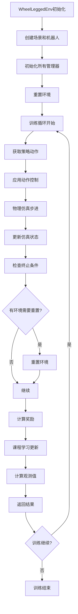

# wheel_legged_env.md

## WheelLeggedEnv

WheelLeggedEnv（轮腿式四足机器人环境）是整个强化学习训练系统的核心类。它整合了之前我们讲解的所有管理器类，形成了一个完整的强化学习环境，遵循 OpenAI Gym 的接口规范。

## 基础概念解释

WheelLeggedEnv 实现了强化学习环境的标准接口：

1. **初始化（```__init__```）**：创建环境并设置参数
2. **步进（step）**：执行一个时间步的仿真和控制
3. **重置（reset）**：将环境恢复到初始状态
4. **观测（get_observations）**：获取当前状态观测值

## 整体架构

```python
class WheelLeggedEnv:
    def __init__(self, ...):     # 环境初始化
    def step(self, actions):     # 执行动作并返回结果
    def reset(self):            # 重置环境
    def reset_idx(self, envs_idx):  # 重置指定环境
```

## 详细功能解析

### 1. 初始化方法 [```__init__```](file:///home/ember/GitHub/wheel_quadruped_genesis/locomotion/wheel_legged_env/simulation_manager.py#L5-L6)

```python
def __init__(self, num_envs, env_cfg, obs_cfg, reward_cfg, command_cfg,
             curriculum_cfg, domain_rand_cfg, terrain_cfg, robot_morphs="urdf",
             show_viewer=False, num_view=1, device="cuda", train_mode=True):
```

**功能**：创建并配置整个训练环境

**主要步骤**：

```python
# 1. 设置基本参数
self.num_envs = num_envs        # 并行环境数量
self.device = torch.device(device)  # 计算设备
self.mode = train_mode          # 训练/评估模式

# 2. 初始化各个管理器
self.scene_manager = SceneManager(self)
self.robot_properties_manager = RobotPropertiesManager(self)
self.command_manager = CommandManager(self)

# 3. 创建场景和机器人
self.scene_manager.create_scene(show_viewer, num_view)
self.scene_manager.add_terrain()
self.scene_manager.add_robot(robot_morphs)
self.scene_manager.build_scene()

# 4. 初始化机器人属性
self.robot_properties_manager.init_robot_properties()
self.robot_properties_manager.init_dof_limits()
self.robot_properties_manager.init_force_limits()

# 5. 初始化其他组件
self._init_reward_functions()
self.command_manager.init_command_ranges()
self._init_buffers()
self._init_terrain_data()
self._init_symmetry_indices()

# 6. 初始化功能模块
self.curriculum_learning = CurriculumLearning(self)
self.domain_randomization = DomainRandomization(self)
self.observation_manager = ObservationManager(self)
self.robot_controller = RobotController(self)
self.simulation_manager = SimulationManager(self)
self.termination_manager = TerminationManager(self)

# 7. 重置环境
self.reset()
```

### 2. 步进方法 [step](file:///home/ember/GitHub/wheel_quadruped_genesis/locomotion/wheel_legged_env/wheel_legged_env.py#L346-L470)

```python
def step(self, actions):
    """
    Execute one simulation step.
    Returns: (observations, privileged_observations, rewards, resets, extras)
    """
```

**功能**：执行一个完整的控制循环

**主要步骤**：

```python
# 1. 应用控制动作
self.robot_controller.apply_actions(actions)

# 2. 物理仿真步进
self.scene.step()

# 3. 更新仿真状态
self.simulation_manager.update_simulation_state()

# 4. 更新步数计数器
self.episode_length_buf += 1

# 5. 更新步态变量（足部接触时间等）
contact_force = self.robot.get_links_net_contact_force()
feet_contact = contact_force[:, self.feet_indices, :].norm(dim=-1) > 1.0
self.feet_air_time += self.dt
self.feet_contact_time += self.dt
self.feet_air_time *= ~feet_contact
self.feet_contact_time *= feet_contact
self.last_contacts = feet_contact

# 6. 添加噪声（如果启用）
if self.noise["use"]:
    self.base_ang_vel[:] += torch.randn_like(self.base_ang_vel) * self.noise["ang_vel"][0] + ...

# 7. 检查终止条件
if self.mode:
    self.termination_manager.check_termination()

# 8. 重置需要重置的环境
if self.mode:
    self.reset_idx(self.reset_buf.nonzero(as_tuple=False).flatten())

# 9. 计算奖励
if self.mode:
    self.rew_buf[:] = 0.0
    for name in self.reward_scales.keys():
        reward_func = getattr(self.reward_functions, f"_reward_{name}")
        rew = reward_func() * self.reward_scales[name]
        self.rew_buf += rew
        self.episode_sums[name] += rew

# 10. 课程学习更新
if self.mode:
    self.curriculum_learning.update_commands()
    self.curriculum_learning.update_termination_conditions()
    self.curriculum_learning.update_control_parameters()

# 11. 计算观测值
slice_obs = self.observation_manager.compute_observations()
self.obs_buf = self.observation_manager.update_history(slice_obs)

# 12. 返回结果
return self.obs_buf, None, self.rew_buf, self.reset_buf, self.extras
```

### 3. 重置方法 `reset` 和 `reset_idx`

```python
def reset(self):
    """Reset all environments."""
    self.reset_buf[:] = True
    self.reset_idx(torch.arange(self.num_envs, device=self.device))
    self.reset_buf[:] = 0
    return self.obs_buf, None

def reset_idx(self, envs_idx):
    """Reset specified environments."""
    # 重置指定的环境到初始状态
    # 包括关节位置、机器人姿态、缓冲区等
```

## 数据缓冲区初始化

```python
def _init_buffers(self):
    """Initialize observation and state buffers."""
    # 基座状态缓冲区
    self.base_lin_vel = torch.zeros((num_envs, 3))    # 线速度
    self.base_ang_vel = torch.zeros((num_envs, 3))    # 角速度
    self.base_pos = torch.zeros((num_envs, 3))        # 位置
    self.base_quat = torch.zeros((num_envs, 4))       # 姿态（四元数）

    # 关节状态缓冲区
    self.dof_pos = torch.zeros_like(self.actions)     # 关节位置
    self.dof_vel = torch.zeros_like(self.actions)     # 关节速度
    self.dof_force = torch.zeros_like(self.actions)   # 关节力

    # 观测缓冲区
    self.obs_buf = torch.zeros((num_envs, num_obs))   # 最终观测值
    self.history_obs_buf = torch.zeros((num_envs, history_length, slice_obs))  # 历史观测

    # 奖励和重置缓冲区
    self.rew_buf = torch.zeros((num_envs,))           # 奖励
    self.reset_buf = torch.ones((num_envs,))          # 重置标志
    self.episode_length_buf = torch.zeros((num_envs,)) # 回合长度

    # 命令缓冲区
    self.commands = torch.zeros((num_envs, num_commands))  # 命令
```

## 实际工作流程

```python
# 1. 创建环境
env = WheelLeggedEnv(
    num_envs=1024,           # 1024个并行环境
    env_cfg=env_cfg,         # 环境配置
    obs_cfg=obs_cfg,         # 观测配置
    reward_cfg=reward_cfg,   # 奖励配置
    # ... 其他配置
)

# 2. 训练循环
obs, _ = env.reset()  # 重置环境，获取初始观测
for epoch in range(num_epochs):
    for step in range(steps_per_epoch):
        # 获取动作（来自强化学习算法）
        actions = policy(obs)
        
        # 执行动作并获取结果
        obs, privileged_obs, rewards, resets, extras = env.step(actions)
        
        # 存储经验用于训练
        buffer.store(obs, actions, rewards, resets)
        
        # 如果有环境需要重置
        if resets.any():
            # 处理回合结束统计
            pass

# 3. 评估模式
obs, _ = env.reset()
while True:
    actions = trained_policy(obs)
    obs, _, rewards, resets, _ = env.step(actions)
    # 评估性能
```

## 设计优势

### 1. 模块化架构

```python
# 每个功能由专门的管理器负责
self.scene_manager           # 场景管理
self.robot_controller        # 机器人控制
self.simulation_manager      # 仿真状态更新
self.observation_manager     # 观测值生成
self.termination_manager     # 终止条件检查
self.reward_functions        # 奖励计算
self.command_manager         # 命令管理
self.curriculum_learning     # 课程学习
self.domain_randomization    # 域随机化
```

### 2. 批量并行处理

```python
# 同时处理1024个环境
self.base_pos = torch.zeros((1024, 3))  # 1024个机器人的位置
self.dof_pos = torch.zeros((1024, 16))  # 1024个机器人的16个关节角度
```

### 3. 标准化接口

```python
# 遵循Gym标准接口
obs, reward, done, info = env.step(action)
obs = env.reset()
```

### 4. 灵活配置

```python
# 通过配置字典控制所有参数
env_cfg = {
    "num_actions": 16,
    "joint_kp": 30.0,
    "joint_kv": 0.8,
    # ...
}
```

## 工作流程图



通过 WheelLeggedEnv，所有组件协调工作，形成了一个完整的强化学习训练环境，可以高效地训练轮腿式四足机器人的行走策略。
